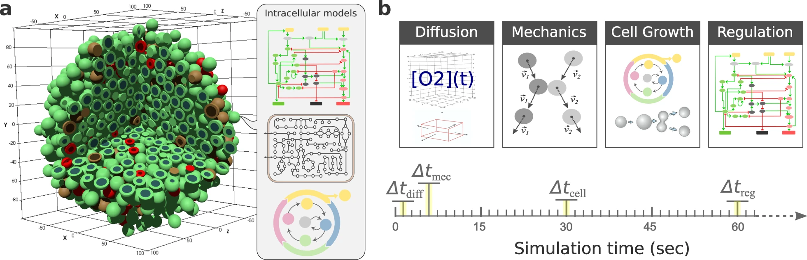
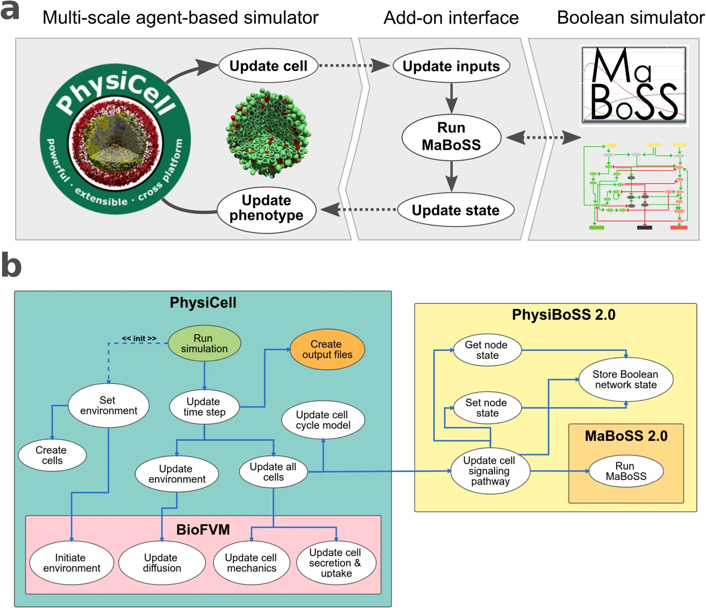

# OmniPhysiBoSS

## Abstract
The primary objective of this project was to extend and parameterize the existing computational frameworks within the PhysiCell and PhysiBoSS simulators using empirical data. Standard agent-based models are typically constructed based on descriptive literature, aimed at reproducing published experimental results. These baseline models are subsequently utilized to simulate therapeutic interventions, evaluating whether a specific drug successfully inhibits a target pathway. However, such configurations fail to account for unintended systemic perturbations across other signaling pathways and their downstream phenotypical impacts [@yue2022computational]. To ensure that these simulations yield predictive, biologically relevant insights capable of detecting potential adverse effects or structural anomalies early in preclinical pipelines, it is crucial to parameterize model topologies and initial conditions directly from tissue-specific omics datasets [@lorenzo2024patient; @bergman2025biwt].

***

## Introduction

### Current State of the Art
The contemporary state of the art in high-performance multicellular simulation is represented by PhysiCell, an open-source, physics-based agent-based simulator [@ghaffarizadeh2018physicell]. To capture autonomous intracellular signaling dynamics, PhysiCell has been extended via the integration of MaBoSS, a software tool that executes continuous-time Markov processes on Boolean networks using the Gillespie algorithm. This combined framework, known as PhysiBoSS, allows for the mathematical modeling of intracellular signal transduction pathways that directly modulate global population-level cell behavior [@poncedeleon2023physiboss; @beal2021personalized]. This integration is critical for our framework, as it provides a mechanistic link to expand biological simulations with arbitrary signaling cascades, enabling the exploration of systemic feedback loops that govern cell fate transitions.

### Comprehensive Description of PhysiCell & PhysiBoSS
PhysiCell is a multi-scale, agent-based computational framework designed to simulate large cell populations in multi-substrate microenvironments [@ghaffarizadeh2018physicell]. The transport of physical substrates and chemical signals is governed by a system of partial differential equations (PDEs) representing diffusion, advection, and decay processes. The spatial domain is discretized via a regular voxel grid, with a default voxel size of $20 \mu\mathrm{m}$. Within this microenvironment, the system accounts for chemical *sources* and *sinks* categorized into two primary modalities:
1. Bulk sources or sinks within the continuous domain.
2. Individual *cells* (agents) that dynamically interface with the local microenvironment by consuming or secreting substrates.

Substrates tracked within this system include fundamental metabolic elements, such as oxygen, as well as extracellular signaling ligands and pharmacological compounds. These entities act as upstream regulators that alter the biochemical state and behavioral phenotype of individual cell agents.

To optimize computational efficiency while preserving physical accuracy, parameter updates are decoupled across distinct, biochemically motivated temporal scales:
- *Simulation/Diffusion time* ($\Delta t_{\mathrm{diff}}$): The fundamental time step governing substrate transport and diffusion processes.
- *Mechanical time* ($\Delta t_{\mathrm{mech}}$): The time step at which mechanical forces, cell-cell adhesion, repulsion, and individual agent velocities are computed and updated.
- *Cell processes time* ($\Delta t_{\mathrm{cells}}$): The macroscopic time step at which individual cell states, metabolic changes, and phenotypic behavioral updates are evaluated.

::: {#fig-architecture}

{width=85% fig-align="center"}

**Structural architecture and add-on-based design of PhysiBoSS 2.0.** (**a**) Modular add-on framework schema that decouples core PhysiCell physical routines from the MaBoSS intracellular Boolean engine, providing scalable logical simulation capabilities to individual cell agents. (**b**) High-level information flow and communication interface mapping real-time programmatic message routing between the agent framework, the continuous-time Markov solver, and the spatial tracking layers.
:::

#### Update harmonogram 
The multi-scale execution pipeline of the simulation is governed by a strict hierarchical structure of distinct, decoupled temporal updates. At time $t = 0$, the computational domain is initialized by establishing the boundary conditions, microenvironmental substrate concentrations, cell positions, and baseline cell-specific states. The sequential execution loop for each subsequent time step proceeds as follows:

- *Run BioFVM update*:
  The fields representing chemical concentration profiles are advanced across the voxel grid. This step calculates mass transport within and between individual voxels, processing secretion and uptake dynamics. Each molecular substrate is governed by an independent partial differential equation (PDE) [@ghaffarizadeh2016biofvm].
- *Run mechanical processes*:
  The velocity of each cell agent is computed based on cell-cell adhesion and repulsion potential forces. Agent motility, including directional migration or random walks, is determined, and physical coordinates are explicitly updated. The mechanical clock is subsequently incremented: $t_{\mathrm{mech}} = t_{\mathrm{mech}} + \Delta t_{\mathrm{mech}}$ [@ghaffarizadeh2018physicell].
- *Run cell processes*:
  If $t \geq t_{\mathrm{cells}}$, macroscopic behavioral routines are executed via the `update_phenotype` routine. This includes evaluating cell cycle transitions, executing apoptosis or necrosis submodels, and computing volume changes across individual cell compartments. The cellular clock is then updated: $t_{\mathrm{cells}} = t_{\mathrm{cells}} + \Delta t_{\mathrm{cells}}$.
- *Run intracellular signaling simulation (MaBoSS)*:
  If the simulation time satisfies the logical condition $t \pmod{\Delta t_{\mathrm{cells}}} = 0$, the intracellular Boolean network of each individual cell agent is simulated using the continuous-time Markov process framework via the Gillespie algorithm [@poncedeleon2023physiboss]. The outputs derived from the signaling cascade directly update the agent's target phenotype properties.
- *Update master simulation clock*:
  The global simulation time is advanced by the smallest discretized temporal increment: $t = t + \Delta t_{\mathrm{diff}}$.

The default temporal resolutions are parameterized to maintain a sharp separation between fast physical diffusion and slower biological behavior:
- $\Delta t_{\mathrm{diff}} \le 0.1 \mathrm{min}$
- $\Delta t_{\mathrm{mech}} = 1.0 \mathrm{min}$
- $\Delta t_{\mathrm{cells}} = 10.0 \mathrm{min}$

::: {#fig-timeline}

{width=85% fig-align="center"}

**PhysiBoSS execution scales and environmental coupling.** (**a**) Schematic representation of a 3D multicellular agent-based system within a discretized continuous microenvironment, integrated with intracellular pathway, metabolism, and cell cycle submodels. (**b**) Temporal execution hierarchy across decoupled simulation clocks: $\Delta t_{\mathrm{diff}}$ for diffusion, substrate uptake, and secretion updates; $\Delta t_{\mathrm{mech}}$ governing cellular mechanical movement and physical interactions; $\Delta t_{\mathrm{cell}}$ driving automated volume updates, cycle phase transitions, and death routines; and $\Delta t_{\mathrm{reg}}$ managing the stochastic integration of individual Boolean networks.
:::

#### Biochemical Model and Numerical Mass Transport
The distribution of multiple interacting substrates within the microenvironment is mathematically described by a vector system of reaction-diffusion partial differential equations. For an arbitrary configuration of $i$ independent chemical species, the model is formulated as follows [@ghaffarizadeh2016biofvm]:

\begin{align}
\frac{\partial \boldsymbol{\rho}}{\partial t}  & = \overbrace{\mathbf{D}\nabla^2\boldsymbol{\rho}}^{\text{diffusion}} - \overbrace{\lambda\boldsymbol{\rho}}^{\text{decay}} + \overbrace{\mathbf{S}(\boldsymbol{\rho}^* - \boldsymbol{\rho})}^{\text{bulk source}} - \overbrace{\mathbf{U}\boldsymbol{\rho}}^{\text{bulk uptake}} \\
 & + \overbrace{\sum_{\text{cells } k} \underbrace{ \delta(\mathbf{x} - \mathbf{x}_k) }_{ \text{cell location} } W_k [\underbrace{ \mathbf{S}_k (\boldsymbol{\rho}_k^* - \boldsymbol{\rho}) }_{ \text{source rates} } - \underbrace{ \mathbf{U}_k\boldsymbol{\rho} }_{ \text{uptake rates} }]}^{\text{sources and uptake by cells}} \quad \text{in } \Omega
\end{align}

To integrate this system numerically over the interval $[t, t + \Delta t_{\mathrm{diff}}]$, the framework utilizes the BioFVM solver, which applies a first-order operator-splitting numerical scheme [@ghaffarizadeh2016biofvm]. It is not stated in articles but, the order of operations within the numerical implementation is crucial as it has profound physical consequences. The solver evaluates local chemical source and sink terms, resolving bulk alterations first, followed by localized cellular secretion and uptake interactions, prior to executing the spatial diffusion step between adjacent voxels. 

This specific operational sequence ensures that high-frequency local cellular-microenvironmental kinetics are captured within the immediate spatial neighborhood before the mass transport flux attenuates these signals across the continuous domain. This approximation accurately reflects the physical reality that intercellular communication via immediate proximity reactions operates on a substantially shorter timescale than macroscopic spatial diffusion across multiple grid voxels.

#### Intracellular Communication and Boolean Network Topology
Intercellular communication and emergent population behaviors are coupled via a mechanistic link where local environmental concentration vectors form the domain of an agent behavioral mapping. In PhysiCell, these microenvironmental inputs were parsed using empirical Hill functions or step-threshold models to directly scale individual phenotypic rate parameters [@ghaffarizadeh2018physicell]. 

To capture the complex non-linear processing of multicellular systems, PhysiBoSS replaces these empirical functions with continuous-time Boolean networks solved via stochastic Gillespie simulations [@poncedeleon2023physiboss]. We categorize the structural topology of these integrated networks into three distinct, decoupled functional layers:

- *Input nodes*: Receptors and sensor molecules that interpret local microenvironmental substrate concentrations and the agent's current phenotypic baseline state.
- *Latent nodes*: Internal signaling cascades, transcription factors, and core regulatory networks that execute intracellular signal transduction.
- *Output nodes*: Downstream phenotypic effectors that terminate the network cascade and directly dictate the behavioral state machine of the cell agent.

A critical limitation of current state-of-the-art implementations is that these output mappings are constructed using manual heuristics and rigid mathematical rule sets. This design significantly restricts model generalization, as existing network architectures are typically optimized for single cell-type lines and isolated regulatory pathways, rendering them incapable of scaling to highly heterogeneous multi-lineage systems derived from multi-omics configurations.

#### Agent Definition and Phenotypic Architecture
To resolve the topological limitations of static models and formally parameterize heterogeneous cell behaviors, the system instantiates each individual cell as an autonomous, discrete agent containing coupled physical and biological state variables. Physically, an agent $k$ at any given simulation time $t$ is fully characterized by its spatial position vector $\mathbf{x}_k$, its current total volume $V_k$, and its individualized mechanical parameters governing cell-cell adhesion and repulsion forces [@ghaffarizadeh2018physicell].

Biologically, the agent's state transitions, metabolic functions, and behavioral responses are encapsulated within a structured, hierarchical `Phenotype` object [@ghaffarizadeh2018physicell]:

##### Cycle
The `Cycle` submodel governs cell division progression by managing state transitions within user-defined cell cycle models. It operates primarily on continuous phase transition rates ($r_{ij}$), which represent the probability per unit time of transitioning from phase $i$ to phase $j$. The architecture natively supports multiple configurations, such as the advanced Ki67 model (tracking $Q$, $K_{\mathrm{i}671}$, and $K_{\mathrm{i}672}$ phases) or standard flow-cytometry-guided models ($G_0/G_1$, $S$, $G_2$, $M$), elements in parenthesses $(S_1, S_2, \ldots)_{i=1}^{n}$ are different phases$ [@ghaffarizadeh2018physicell]. 

##### Death
The `Death` submodel explicitly formalizes cell clearance via independent, uncoupled execution pathways, namely apoptosis and necrosis. Each pathway is implemented as a stochastic process governed by a specific death rate parameter ($r_{\mathrm{A}}$ for apoptosis, $r_{\mathrm{N}}$ for necrosis). Upon initiation, the model triggers the degradation phase, freezing standard metabolic behaviors and modifying volume parameters to simulate cell lysis or phagocytosis [@ghaffarizadeh2018physicell].

##### Volume
The `Volume` submodel dynamically tracks and recalculates the physical size and spatial occupancy of the agent. The total volume $V_k$ is mathematically decomposed into individual fluid and solid fractions across distinct anatomical compartments:
$$V_k = V_{\mathrm{fluid}} + V_{\mathrm{solid}} = (V_{\mathrm{nuclear,\,fluid}} + V_{\mathrm{nuclear,\,solid}}) + (V_{\mathrm{cytoplasmic,\,fluid}} + V_{\mathrm{cytoplasmic,\,solid}})$$
The expansion or shrinkage of these fractions is modeled via ordinary differential equations (ODEs) driven by fluid transport rates and macromolecular synthesis coefficients [@ghaffarizadeh2018physicell].

##### Mechanics
The `Mechanics` submodel dictates the physical, force-based interactions between adjacent cell agents and their geometric boundaries. It computes net displacement vectors by balancing cell-cell adhesion and cell-cell repulsion forces via an adhesive potential function. Parameters stored here include the cell-cell adhesion strength ($cca$), cell-cell repulsion strength ($ccr$), and the maximum interaction distance ($R_{\mathrm{max}}$), which define the mechanical equilibrium state of the multicellular cluster [@ghaffarizadeh2018physicell].

##### Motility 
The `Motility` submodel controls autonomous spatial migration and active locomotion. It models cell movement as a biased random walk, tracking parameters such as migration speed ($v_{\mathrm{mot}}$), persistence time ($\tau_{\mathrm{mot}}$), and a continuous directional bias vector ($\mathbf{d}_{\mathrm{bias}}$). The orientation of $\mathbf{d}_{\mathrm{bias}}$ can be coupled to microenvironmental substrate gradients to simulate directed chemotaxis scaled by a sensitivity coefficient ($b$) [@ghaffarizadeh2018physicell].

##### Secretion
The `Secretion` submodel serves as the primary programmatic interface between the discrete agent and the continuous BioFVM microenvironment solver. For each tracked molecular substrate $i$, this class defines three independent, cell-specific coefficients: the automated secretion rate ($S_{k,i}$), the target saturation density ($\rho_{k,i}^*$), and the localized uptake rate ($U_{k,i}$). These parameters directly formulate the cellular source-sink term inside the master partial differential equations [@ghaffarizadeh2018physicell].

##### PhysiBoSS implementation
In PhysiBoSS, these continuous phenotypic parameters are dynamically adjusted via an integrated Boolean network framework. Because the architecture allows the user to customize the internal signal transduction cascades with arbitrary topologies, there is no single monolithic or predefined mapping that dictates agent behaviors [@letort2019physiboss]. 

The core integration methodology relies on a modeler-defined translation interface located at the boundaries of the network [@poncedeleon2023physiboss]:

- *Input Mapping*: Continuous microenvironmental concentrations or cellular state variables are binarized using specific mathematical transfer functions (such as direct thresholds, linear mappings, or non-linear Hill functions) to dictate the active ($1$) or inactive ($0$) states of the network's receptor nodes.
- *Output Mapping*: Individual biological behaviors are regulated by parsing the stochastic state transitions of designated terminal or output nodes. Rather than enforcing a hardcoded execution route, the system serves as a customizable state-machine interface. The terminal nodes modify cell processes by directly gating continuous mechanical speeds, scaling mass accumulation rates, or altering phase transition probabilities within the phenotypic submodels.

Consequently, the framework does not implement a single immutable set of rules; the biological outcomes are entirely emergent and depend on how the modeler configures the terminal network nodes to scale, trigger, or override the underlying physical variables.

***

### Target Modalities and Multi-Omics Framework
Standard implementation pipelines in frameworks such as PhysiCell typically rely on models parameterized from isolated literature reports, which attempt to replicate phenotypic observations from narrow experimental setups [@ghaffarizadeh2018physicell]. This approach lacks representation of secondary signaling cascades, receptor cross-talk, and systemic pathway perturbations that are critical when simulating complex disease states or pharmacological interventions [@yue2022computational]. 

To overcome these constraints, the OmniPhysiBoSS library introduces a structured framework designed to ingest high-dimensional spatial multi-omics datasets encapsulated within multimodal containers. The absolute minimal data requirement for our parameterization pipeline consists of:

- *Spatial single-cell transcriptomics (spatial scRNA-seq)*: Provides continuous mRNA count matrices across localized tissue coordinates, establishing the baseline expression profiles for downstream intracellular and intercellular signaling networks.
- *Spatial coordinates and tissue architecture*: Maps individual cell barcodes or transcriptomic spots onto physical coordinates $X \in \mathbb{R}^{N \times 2}$. This geometric data is processed to construct spatial connectivity graphs, allowing us to validate whether unsupervised cellular clustering accurately recapitulates the native histological microenvironment.

***

## Methods and Materials 
The framework processes multimodal datasets sequentially to construct integrated computational models. First, raw spatial multi-omics structures are harmonized by intersecting cell matrices across independent data views. Second, spatial cellular communication graphs and directed causal intracellular pathway topologies are extracted from unified molecular resources. Finally, these processed features parameterize the spatial coordinates, phenotypic states, and stochastic Boolean regulatory networks of individual agents within the simulator.

### Data preparation
The data preparation layer is mediated by a dedicated input/output (I/O) interface that synchronizes divergent single-cell and spatial tracking modalities. The module ingests high-dimensional multi-modal containers (`MuData`), verifies internal coordinate consistency, and applies forward-compatible matrix updating routines to align feature lists across sub-modality blocks. This programmatic decoupling isolates upstream biological data cleansing from the execution of downstream physical simulations.

#### Unify modalities
To ensure dimensional consistency across multi-omics datasets, the system executes a strict mathematical inner join across all active modality layers within the global container. Let $\mathcal{M}$ represent the set of all loaded omics modalities (e.g., RNA, spatial coordinates, protein arrays), where each modality $m \in \mathcal{M}$ contains a set of unique cell barcodes $C_m$. Unification models run as follows:
$$C_{\mathrm{unified}} = \bigcap_{m \in \mathcal{M}} C_m$$
Features across all views are synchronized to include only the cell barcodes present in $C_{\mathrm{unified}}$. In scenarios where the computed intersection evaluates to an empty set ($C_{\mathrm{unified}} = \emptyset$), the execution halts, and a automated leave-one-out diagnostic routine is triggered. This audit calculates the pairwise cardinalities and intersection sizes for all combinations excluding one modality at a time:
$$C_{\text{audit}, m} = \bigcap_{k \in \mathcal{M} \setminus \{m\}} C_k$$
This enables the framework to identify the precise bottleneck layer that isolates the global union and explicitly informs the user which omics view contains disjoint indices.

#### Get ligand receptor pairs
Spatial intercellular communication fields are derived using the Liana+ computing engine integrated with the OmniPath meta-resource database [@dimitrov2024liana; @turei2026omnipath]. OmniPath acts as a comprehensive, curated integration system that unifies over 100 primary database registries, mapping verified molecular interactions, signaling pathways, and localized receptor-ligand topologies.

To infer spatial cell-cell signaling, the framework builds a localized spatial connectivity graph over the continuous physical coordinates. For each valid ligand-receptor pairing derived from the OmniPath registry, a local bivariate cross-correlation analysis (such as local cosine similarity or localized Moran's $I$ metrics) is evaluated across neighboring cell agents. To ensure statistical robustness, permutation testing is performed by randomly shuffling cellular barcodes across the spatial coordinates for a set number of iterations ($B$). This generates an empirical null distribution for each interaction pair:
$$p = \frac{1}{B} \sum_{b=1}^{B} \mathbb{I}\left( I_{\mathrm{perm}}^{(b)} \geq I_{\mathrm{observed}} \right)$$
The resulting ligand-receptor interactions are subsequently filtered based on these empirical $p$-values and cross-correlation thresholds, retaining only spatially co-localized signaling links.

#### Intercellular information 
Once the significant spatial ligand-receptor pairs are identified, the pipeline enriches the results by cross-referencing unique interaction rows with the expanded OmniPath intercell metadata registry [@turei2026omnipath]. The methodology extracts curated database annotations corresponding to both the source ligand and target receptor components. The system automatically processes structural discrepancies by synchronizing gene symbol variants, dropping redundant or duplicated interaction entries to preserve a strict 1-to-1 mapping, and explicitly normalizing unmapped fields with null references (`None`). The compiled intercellular dataframe is then registered within the root container's unstructured metadata (`.uns`), establishing a curated spatial communication index.

#### Intracellular information 
Intracellular regulatory structures are constructed by querying directed and signed signaling network graphs from OmniPath [@turei2026omnipath]. The algorithm parses the raw network interaction matrix to infer definitive causal directions where the consensus direction flag is active. Crucially, the biological logic of these causal links is formalized into explicit mathematical signs ($s_{ij}$):

- *Stimulatory pathways*: Pathways where inductive or activating mechanisms are verified (`is_stimulation = 1` and `is_inhibition = 0`) are assigned a positive unity constant ($s_{ij} = +1$).
- *Inhibitory pathways*: Pathways where repressive or silencing mechanisms are verified (`is_stimulation = 0` and `is_inhibition = 1`) are assigned a negative unity constant ($s_{ij} = -1$).

Ambiguous, dual-sign, or unverified interactions are filtered out. The final signed edgelist matrix is stored within the global container, providing the structural topology required to automatically construct individual MaBoSS Boolean network equations.

To ensure biological accuracy and functional coverage during network reconstruction, the OmniPath queries are restricted to two high-confidence, manually curated database registries:

- *SIGNOR (Signaling Network Open Resource)*: Utilized because it provides structured, fully causal, and binary-mappable relations (activations and inhibitions) specifically focused on human and mouse signaling cascades. Each interaction is linked to precise experimental evidence, ensuring that the inferred regulatory signs ($s_{ij}$) correspond to proven molecular mechanism dependencies rather than statistical associations.
- *NetPath*: Incorporated to augment the network topology with comprehensive, curated maps of major signaling pathways involved in core cellular processes (such as immune receptor signaling and cancer-related pathways). Its inclusion guarantees that the downstream Boolean network captures whole receptor-to-transcription-factor cascades, providing the structural connectivity required to link extracellular ligand reception to macro-phenotypic cellular outcomes.

#### Cells clustering 
To separate the tissue space into discrete, phenotypically distinct cellular neighborhoods without relying on biased manual labels, the pipeline executes an unsupervised graph-partitioning routine over the transcriptomic modality. The system first projects the aligned expression matrix into a low-dimensional Principal Component Analysis (PCA) subspace to capture the primary axes of expression variance. Using these reduced coordinates, a Shared Nearest Neighbor (SNN) proximity graph is constructed. 

The cellular network is then partitioned into distinct communities using the Leiden modularity optimization algorithm, which maximizes the objective function:
$$Q = \frac{1}{2m} \sum_{ij} \left( A_{ij} - \gamma \frac{k_i k_j}{2m} \right) \delta(c_i, c_j)$$
where $A_{ij}$ represents the edge weight between cells $i$ and $j$, $k$ denotes the node degrees, $\gamma$ is the resolution parameter, and $\delta(c_i, c_j)$ indicates cluster assignment. The resulting discrete cluster factors are mapped to a two-dimensional Uniform Manifold Approximation and Projection (UMAP) embedding for structural validation. This modular clustering serves as the baseline blueprint for initializing heterogeneous cell types within the physical rows of the agent simulator.

***

### General Settings and Model Calibration

#### Domain settings
The physical scale of the simulation domain is parameterized using structural metadata embedded within the spatial transcriptomics dataset (e.g., 10x Genomics Visium). To map mathematical pixel coordinates to physical micrometers ($\mu\mathrm{m}$), the configuration module measures the spatial dot pitch array against a known biological reference standard.

The baseline calibration leverages the fixed spatial dimension of a standard transcriptomic spot capture area, where the diameter is defined as $d_{\mathrm{spot}} = 55 \mu\mathrm{m}$ [@btaf571]. Let $p_{\mathrm{spot}}$ represent the spot diameter measured in pixels within the high-resolution tissue image asset. The continuous spatial scaling factor, defining the micron-per-pixel transformation ratio ($\alpha$), is derived as follows:
$$\alpha = \frac{d_{\mathrm{spot}}}{p_{\mathrm{spot}}}$$

Using the calculated scaling matrix, the minimum and maximum boundaries of the spatial domain are mapped from the bounding coordinate rows of the cell tracking matrix ($X_{\mathrm{pixel}}$). To prevent edge truncation anomalies during multi-agent mechanical interaction calculations, a directional padding threshold ($\Delta_{\mathrm{pad}}$) is appended to each computed axis:
$$X_{\mathrm{min}} = (\min X_{\mathrm{pixel}} \cdot \alpha) - \Delta_{\mathrm{pad}}, \quad X_{\mathrm{max}} = (\max X_{\mathrm{pixel}} \cdot \alpha) + \Delta_{\mathrm{pad}}$$
$$Y_{\mathrm{min}} = (\min Y_{\mathrm{pixel}} \cdot \alpha) - \Delta_{\mathrm{pad}}, \quad Y_{\mathrm{max}} = (\max Y_{\mathrm{pixel}} \cdot \alpha) + \Delta_{\mathrm{pad}}$$

The depth along the $Z$-axis is centered symmetrically around the origin based on the target slice thickness ($\Delta z$): $Z_{\mathrm{min}} = -\frac{\Delta z}{2}$, $Z_{\mathrm{max}} = \frac{\Delta z}{2}$. The continuous space is then partitioned into a regular cell grid with voxel step resolutions matching the master numerical diffusion setup.

#### Time settings
The master execution clocks and decoupled stepping frequencies are automatically configured using the default standardized temporal parameters established in baseline multicellular simulator validation suites [@ghaffarizadeh2018physicell]. The global system advances via the fixed step parameters $\Delta t_{\mathrm{diff}} = 0.1\,\mathrm{min}$, $\Delta t_{\mathrm{mech}} = 1.0\,\mathrm{min}$, and $\Delta t_{\mathrm{cells}} = 10.0\,\mathrm{min}$.

***

### Cell annotation 
To parameterize cell-type-specific rules within individual agent states without introducing manual labeling bias, the framework extracts biological lineage components from the spatial transcriptomics data views. To maintain absolute operational stability, the assignment logic must satisfy a non-overlapping uniqueness constraint. This constraint ensures that multiple independent spatial clusters are not mapped to identical lineage categories, which would collapse cellular heterogeneity.

#### Jaccard strategy
The discrete annotation strategy isolates cluster-specific marker genes by evaluating a Wilcoxon rank-sum test across the transcriptomic layer, retaining the top $N$ ranked highly-expressed genes for each community. Let $\mathcal{G}_{\mathrm{cluster}}$ represent the set of empirical marker genes extracted from a given spatial community, and $\mathcal{G}_{\mathrm{reference}}$ denote a curated set of verified cell-type markers extracted from the CellMarker 2.0 repository anchored on unique Cell Ontology (CL) identifiers.

The alignment score ($S_{\mathrm{Jaccard}}$) between a spatial cluster and a reference cell type is computed via the binary Jaccard similarity coefficient:
$$S_{\mathrm{Jaccard}} = \frac{|\mathcal{G}_{\mathrm{cluster}} \cap \mathcal{G}_{\mathrm{reference}}|}{|\mathcal{G}_{\mathrm{cluster}} \cup \mathcal{G}_{\mathrm{reference}}|}$$

#### Decoupler strategy
The continuous annotation strategy models cluster identity by evaluating statistical enrichment profiles over the entire expression matrix using a Univariate Linear Model (ULM) framework wrapper. Instead of subsetting a fixed number of top features, the algorithm fits a linear regression model where the standardized gene expression log-fold changes or cluster-specific statistical test metrics ($t$) act as the dependent variable, and the binary indicators of the CellMarker 2.0 reference database matrix ($M$) serve as the independent predictor:
$$t = \beta_0 + \beta_1 M + \epsilon$$

The resulting t-value of the regression coefficient ($\beta_1$) defines the continuous enrichment score ($S_{\mathrm{ULM}}$) for each candidate cell ontology target, capturing full-spectrum distribution shifts across low-abundance regulatory genes.

#### Global Collision Resolution
To satisfy the absolute coverage constraint and prevent duplicate cell-type mappings across distinct clusters, individual affinity scores generated by either the Jaccard or ULM modules are mapped into a global cost matrix ($C \in \mathbb{R}^{U \times V}$), where entry $C_{ij}$ represents the inverse assignment score for mapping cluster $i$ to reference identifier $j$. 

The pipeline prevents topological collisions by solving a maximum weight bipartite matching problem using the formal Kuhn-Munkres (Hungarian) linear sum assignment algorithm:
$$\min \sum_{i} \sum_{j} C_{ij} x_{ij}$$
$$\text{subject to } \sum_{j} x_{ij} = 1, \quad \sum_{i} x_{ij} \leq 1, \quad x_{ij} \in \{0, 1\}$$

This global optimization guarantees a mathematically unique, one-to-one alignment mapping between spatial tissue clusters and verified cell lineages.

***

### Agent Phenotype Parameterization

#### Phenotype and Network Output Constraints
The parameterization of individual cell phenotypes is not implemented. To construct the phenotypic layers, it is necessary to first define the terminal output nodes of the MaBoSS Boolean network. A systematic method to dynamically derive cell-type-specific kinetic objects, such as cell cycle models or death rates, solely from spatial transcriptomics configurations could not be established. Because these core mechanical parameters depend entirely on the presence of functional terminal nodes, further development of the phenotypic submodels was halted.

#### MaBoSS Network Synthesis
The internal MaBoSS networks are intended to link environmental receptor nodes to downstream phenotypic effectors through transcription factors and central regulatory proteins. However, due to the high complexity of manually defining these mappings for arbitrary cell types, the dynamic reconstruction of the logical networks has not been completed.

***

### Microenvironmental Fields
The continuous microenvironment is intended to be initialized using the specific ligand-receptor interaction pairs discovered within the spatial tissue layout. Under this framework, continuous molecular sources and sinks would be directly governed by the active states of the internal logical pathways. Specifically, cells with active target cascades would function as sources, secreting continuous signaling ligands into the simulation space. Because the upstream network topologies and their input-output relationships remain unresolved, these environmental boundary conditions and source-sink variables are currently undefined.

### Initial Conditions
The physical and biological initial conditions of individual cell agents are determined by the spatial multi-omics dataset. Physically, the starting coordinates of each agent are taken directly from the continuous spatial coordinates of the corresponding cell in the data group. Biologically, the baseline properties of each independent agent are initialized according to the characteristics of its assigned cluster. Each unsupervised cluster is parsed as a distinct cohort model, ensuring that the initial tissue density and spatial composition match the biological sample. Due to the unresolved dependencies in the phenotype and input definitions, the end-to-end automated parsing loop for these initial states into the simulator remains incomplete.

### Execution 
To execute and analyze these multicellular simulations, the pipeline was intended to integrate UQ-PhysiCell, an open-source Python framework designed for uncertainty quantification and automated parameter analysis [@rocha2026uq]. Although an early testing module interfacing with this tool was constructed, it was subsequently deprecated and removed from the production repository during architectural pruning.

*** 

## Results and Proposed Evaluation Metrics

### Biological Output Mapping Constraints
The key technical bottleneck preventing the end-to-end automation of the pipeline is the lack of a deterministic algorithm to identify and configure terminal output nodes within the derived graphs. While the structural extraction of upstream pathways from repositories is functional, no robust methodology could be formulated to dynamically map cell-type-specific transcriptomic profiles directly to discrete Boolean effectors (such as automated cell cycle or programmed death thresholds). Because these output boundary configurations could not be derived programmatically for arbitrary cell lineages, further implementation of the downstream simulation models could not be completed.

### Computational Complexity and Scalability Analysis
To establish engineering boundaries for the integrated framework, future benchmarks must analyze the structural scalability of the stochastic MaBoSS solvers. The evaluation should systematically measure execution time and memory overhead as a function of network size (node and edge cardinality) and agent population density. Defining these physical limitations is critical to determining the maximum allowable complexity of the intracellular Boolean models and the total volume of single-cell multi-omics inputs that the system can process within reasonable computational horizons.

### Validation Against Predictive Clinical Frameworks
The proposed model validation strategy requires benchmarking simulated drug perturbations against annotated clinical datasets. The target objective is to evaluate two discrete microenvironmental states: untreated diseased tissue setups versus pharmacologically treated systems. By introducing continuous therapeutic compound fields and modifying corresponding network nodes, the analysis would verify if the simulator can dynamically predict reported clinical outcomes and off-target feedback loops. 

## Discussion

### Project Scope and Data Limitations
The end-to-end integration of spatial transcriptomics with multiscale agent-based models was not finalized due to a substantial underestimation of data resource dependencies. The primary bottlenecks involved the structural annotation of multi-omics modalities and the lookup mapping of Gene Ontology (GO) terms across heterogeneous cell lines, which could not be systematically resolved within the project's timeline.

### Future Perspectives
Subsequent development during the upcoming research cycle will focus on parsing the hierarchical layers of the Gene Ontology (GO) and Cell Ontology (CL) databases to map biological functions directly to specific network outputs. Integrating these standardized data registries is expected to provide the required biological constraints to automate the extraction of functional terminal nodes based on transcriptomic cell-type classification.

### Analysis of Comparable Frameworks
A comprehensive review of existing literature confirms that current platforms approach spatial parameterization through restricted, decoupled strategies. Specifically, state-of-the-art implementations either restrict their focus to predicting specific gene-knockout phenotypes within pre-configured logical models [@beal2021personalized], or utilize single-cell profiles solely to establish the static initial spatial coordinates of pre-parameterized cellular agents [@bergman2025biwt]. OmniPhysiBoSS attempts to bridge this gap by proposing a unified platform where both the physical geometry and the dynamic intracellular signaling structures are constructed directly from multi-modal tissue data.
